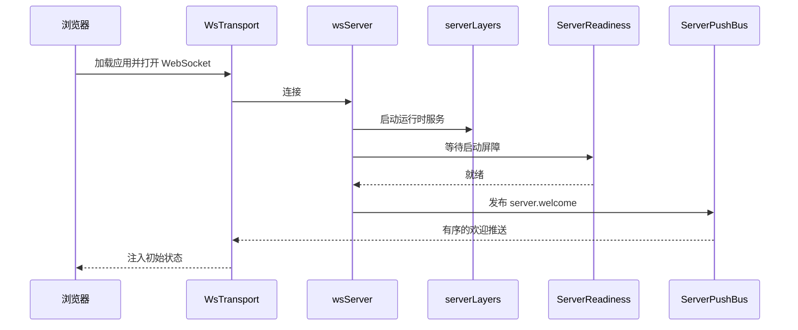
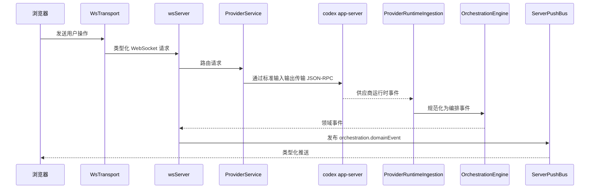
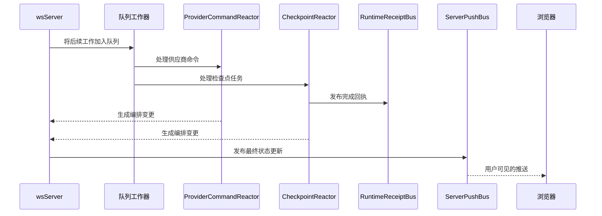

# 架构

T3 Code 以 **Node.js WebSocket 服务器**的形式运行。它封装 `codex app-server`（通过标准输入输出传输 JSON-RPC），并提供 React Web 应用。

```
┌─────────────────────────────────┐
│  浏览器（React + Vite）         │
│  wsTransport（状态机）          │
│  在边界处解码类型化推送         │
└──────────┬──────────────────────┘
           │ ws://localhost:3773
┌──────────▼──────────────────────┐
│  apps/server（Node.js）         │
│  WebSocket + HTTP 静态服务器    │
│  ServerPushBus（有序推送）      │
│  ServerReadiness（启动门禁）    │
│  OrchestrationEngine            │
│  ProviderService                │
│  CheckpointReactor              │
│  RuntimeReceiptBus              │
└──────────┬──────────────────────┘
           │ 通过标准输入输出传输 JSON-RPC
┌──────────▼──────────────────────┐
│  codex app-server               │
└─────────────────────────────────┘
```

## 组件

- **浏览器应用**：React 应用渲染会话状态，管理客户端 WebSocket 传输，并将类型化推送事件视为服务器运行时细节与 UI 状态之间的边界。

- **服务器**：`apps/server` 是主协调器。它提供 Web 应用、接受 WebSocket 请求、在欢迎客户端前等待启动就绪，并通过一条统一的有序推送路径发送全部出站推送。

- **供应商运行时**：`codex app-server` 执行实际的供应商和会话工作。服务器通过标准输入输出上的 JSON-RPC 与其通信，并将这些运行时事件转换为应用的编排模型。

- **后台工作器**：运行时摄取、命令响应和检查点处理等长时间异步流程，以队列支持的工作器运行。这样可以保持工作顺序、减少时序竞争，并让测试能够以确定性的方式等待系统进入空闲状态。

- **运行时信号**：服务器会在重要异步里程碑完成时发出轻量的类型化回执，例如检查点捕获、差异最终确定或一次 Turn 完全静止。测试和编排代码等待这些信号，而不是轮询内部状态。

## 事件生命周期

### 启动和客户端连接



1. 浏览器启动 [`WsTransport`][1]，并在 [`wsNativeApi`][2] 中注册类型化监听器。
2. 服务器在 [`wsServer`][3] 中接受连接，并启动 [`serverLayers`][7] 定义的运行时图。
3. [`ServerReadiness`][4] 等待关键启动屏障完成。
4. 服务器就绪后，[`wsServer`][3] 会将 [`ws.ts`][6] 合约中的 `server.welcome` 通过 [`ServerPushBus`][5] 发出。
5. 浏览器通过 [`WsTransport`][1] 接收这条有序推送，[`wsNativeApi`][2] 用它初始化客户端本地状态。

### 用户 Turn 流程



1. 浏览器中的用户操作通过 [`WsTransport`][1] 和 [`nativeApi`][12] 中的浏览器 API 层变成类型化请求。
2. [`wsServer`][3] 使用 [`ws.ts`][6] 中的共享 WebSocket 合约解码请求，并将其路由到正确的服务。
3. [`ProviderService`][8] 启动或恢复会话，并通过标准输入输出上的 JSON-RPC 与 `codex app-server` 通信。
4. [`ProviderRuntimeIngestion`][9] 将供应商原生事件拉回服务器，并转换为编排事件。
5. [`OrchestrationEngine`][10] 持久化这些事件、更新读取模型，并将其公开为领域事件。
6. [`wsServer`][3] 通过 [`ServerPushBus`][5]，在 [`orchestration.ts`][11] 定义的频道上将这些更新推送到浏览器。

### 异步完成流程



1. 有些工作会在初始请求返回后继续进行，尤其是 [`ProviderRuntimeIngestion`][9]、[`ProviderCommandReactor`][13] 和 [`CheckpointReactor`][14] 中的工作。
2. 这些流程使用 [`DrainableWorker`][16] 以队列支持的工作器形式运行，有助于保持副作用有序，并使测试同步具有确定性。
3. 里程碑完成时，服务器会在 [`RuntimeReceiptBus`][15] 上发出类型化回执，例如检查点完成或 Turn 静止。
4. 测试和编排代码等待这些回执，而不是轮询 Git 状态、投影或计时器。
5. 这些异步工作产生的任何用户可见状态变更，仍会通过 [`wsServer`][3] 和 [`ServerPushBus`][5] 返回。

[1]: ../../../packages/client-runtime/src/rpc/session.ts
[2]: ../../../packages/client-runtime/src/rpc/client.ts
[3]: ../../../apps/server/src/ws.ts
[4]: ../../../apps/server/src/serverRuntimeStartup.ts
[5]: ../../../apps/server/src/serverLifecycleEvents.ts
[6]: ../../../packages/contracts/src/rpc.ts
[7]: ../../../apps/server/src/bootstrap.ts
[8]: ../../../apps/server/src/provider/Layers/ProviderService.ts
[9]: ../../../apps/server/src/orchestration/Layers/ProviderRuntimeIngestion.ts
[10]: ../../../apps/server/src/orchestration/Layers/OrchestrationEngine.ts
[11]: ../../../packages/contracts/src/orchestration.ts
[12]: ../../../packages/client-runtime/src/rpc/client.ts
[13]: ../../../apps/server/src/orchestration/Layers/ProviderCommandReactor.ts
[14]: ../../../apps/server/src/orchestration/Layers/CheckpointReactor.ts
[15]: ../../../apps/server/src/orchestration/Layers/RuntimeReceiptBus.ts
[16]: ../../../packages/shared/src/DrainableWorker.ts
